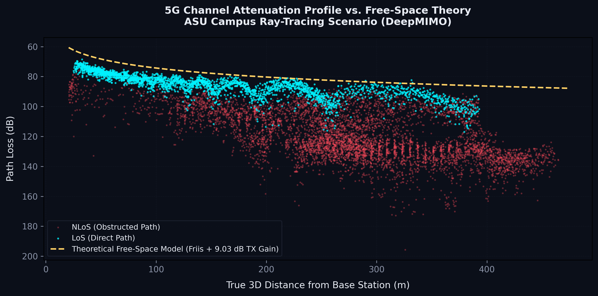
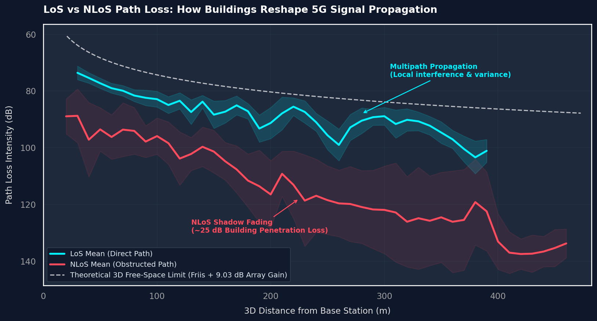

# 5G Channel Attenuation & Path Loss Analysis using DeepMIMO

  


An analysis of 5G channel attenuation using the DeepMIMO ASU Campus 3.5 GHz ray-tracing scenario. The study compares empirical path loss with the theoretical Friis free-space model under Line-of-Sight (LoS) and Non-Line-of-Sight (NLoS) propagation conditions.

#### Dataset Citation
> [DeepMIMO](https://deepmimo.net/) - ASU Campus 3.5 GHz ray-tracing scenario (asu_campus_3p5).


## Overview

In high-frequency wireless networks (such as 5G-Advanced and 6G), physical blockages like buildings, foliage, and vehicles play a defining role in coverage, link budgets, and signal quality. This project:
* **Quantifies Blockage Penalties:** Measures how much buildings on the ASU Campus actually reduce signal strength compared to ideal free-space models.
* **Separates Physical Phenomena:** Evaluates Line-of-Sight (LoS) and Non-Line-of-Sight (NLoS) signal paths individually.
* **Bridges Theory and Digital Twins:** Compares the theoretical Friis transmission curve against highly realistic, ray-traced channel data from DeepMIMO.


## Results

### 1. 5G Channel Attenuation Profile vs. Free-Space Theory
This scatter plot maps out downsampled channel attenuation points for thousands of receiver locations, compared directly with the theoretical Friis model adjusted for antenna array gains (8-element TX array, ~9.03 dB gain).



* **Key Observation:** LoS receiver points track the theoretical Friis boundary closely, exhibiting realistic variance caused by ground reflections and multipath fading (constructive and destructive interference). In contrast, NLoS points experience significantly higher path loss due to severe shadow fading and building penetration loss.

### 2. LoS vs. NLoS Path Loss Mean Profile (with Standard Deviation Bands)
By grouping the receiver points into distance bins, we smooth out local multipath fading to reveal the clean physical trends governing the environment.



* **Shadow Fading Loss:** At approximately 220–250 meters, we observe an average of **~25 dB building penetration / shadow-fading loss** on the ASU campus digital twin.
* **Variance Discrepancy:** The variance (shaded standard deviation band) is significantly wider for NLoS paths. This confirms that NLoS propagation is highly sensitive to the specific physical geometry/angle of obstacles, whereas LoS paths are governed almost entirely by distance.
* **Multipath propagation effects:** Local interference causes minor ripples in the LoS mean profile, consistent with real-world two-ray channel models.


## File Structure

```text
.
├── .gitignore
├── LICENSE
├── README.md
├── methodology.md
├── requirements.txt
├── src/
│   ├── path_loss_analysis.py
│   └── plot_style.py
├── notebooks/
│   └── los_nlos_path_loss.ipynb
└── plots/
    ├── asu_campus_3p5_los_nlos_path_loss_profile.png
    └── asu_campus_3p5_path_loss_scatter.png
```


## Installation & Usage

### Prerequisites

- Python 3.8 or later

Install the required packages:

```bash
pip install -r requirements.txt
```

The required DeepMIMO scenario is downloaded automatically the first time the analysis is run.

### Running the Analysis

Open `notebooks/los_nlos_path_loss.ipynb` in your preferred Jupyter environment (e.g., VS Code, JupyterLab, or Jupyter Notebook) and run the cells from top to bottom.

The generated figures are saved to the `plots/` directory.


## License

This project is licensed under the MIT License. See the [LICENSE](LICENSE) file for details.

---

*Built by [rhthm](https://github.com/rhthm).*
